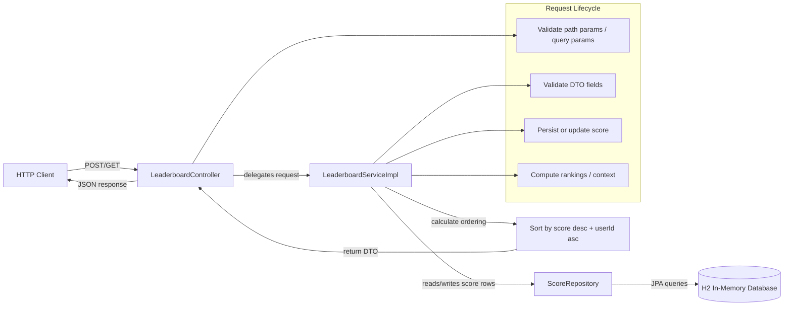

# Leaderboard Service

Minimal Spring Boot MVP for a global gaming leaderboard.

## Architecture Flow Diagram



## Overview

This project implements the MVP leaderboard workflow with the following flow:

- `POST /api/users/{userId}/scores`
  - accepts a gameId and score
  - replaces the previous score for that user/game pair
  - validates input before persisting

- `GET /api/rankings/top?gameId={gameId}&limit={limit}`
  - returns the top ranked users for a given game
  - ranking order is score descending, then userId ascending for ties

- `GET /api/users/{userId}/rankings?gameId={gameId}`
  - returns the current user rank and the immediately surrounding users
  - returns 404 if the game or user is not present in that leaderboard

## Tech Stack

- Java 17
- Spring Boot 4.1.1
- Spring Web MVC
- Spring Data JPA
- H2 in-memory database

## Prerequisites

- Java 17+
- Maven wrapper included in project

## Local Setup

From the project root:

```bash
cd /workspaces/leaderboard_Service/demo
```

## Run the Application

```bash
./mvnw spring-boot:run -DskipTests
```

The app starts on:

```text
http://localhost:8080
```

## Run the Targeted Test Suite

```bash
./mvnw test -Dtest=LeaderboardServiceTest
```

## Quick API Checks

### Submit a score

```bash
curl -i -X POST http://localhost:8080/api/users/user1/scores \
  -H "Content-Type: application/json" \
  -d '{"gameId":"game1","score":5000}'
```

Expected status: `201 Created`

### Top rankings

```bash
curl -i "http://localhost:8080/api/rankings/top?gameId=game1&limit=10"
```

Expected status: `200 OK`

### User context

```bash
curl -i "http://localhost:8080/api/users/user1/rankings?gameId=game1"
```

Expected status: `200 OK` if user exists; otherwise `404 Not Found`

## Validation Rules

- userId must be present and not blank
- gameId must be present and not blank
- score must be present and >= 0
- limit must be > 0
- malformed JSON or invalid request body returns `400 Bad Request`

## Notes

This is intentionally a minimal prototype. The ranking logic is computed in application code from persisted score rows, and the database is in-memory for fast local validation and demo execution.
